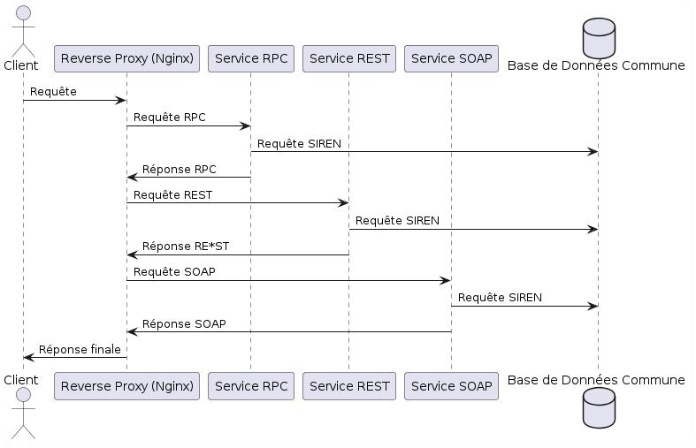

# Schéma UML : 

Ce diagramme montre l'intéractiin entre un client, un proxy inverse (Nginx) et divers services (RPC, REST, SOAP) et une base de données commune.

Composants 
==============
1. Client :
2. Reverse Proxy : serveur quu gère les requêtes des clients et les transmet au services approprié
3. Service RPC : permet de communiquer avce la base de données
4. Service REST : Permet la communication
5. Service SOAP : utilise le protocole SOAP pour les opérations
6. Base de données communes : base de données centralusée qui stocke les données accessibles par tous les services

   Séquence des événements
   ========================
   1. Requête initiale du client : le client envoie une reqiuête au revserse proxy
   2. Routage du reverse Proxy : il transmet la requête à l'un des services disponibles en foncton de la nature de la requête
   3. Requête RPC :
* Revrese proxy transmet une requête au service RPC
* Service RPC envoie une requête SIREN à la base de données commune
* La bse de données retourne la réponse au service RPC
* Le service RPC renvoie la réponse au reverse proxy

  4. Requête REST
*Le proxy inverse transmet une requête au service REST.
*Le service REST envoie une requête SIREN à la base de données commune.
*La base de données retourne la réponse au service REST.
*Le service REST renvoie la réponse au reverse proxy.

5. Requête SOAP
*Le proxy inverse transmet une requête au service SOAP.
*Le service SOAP envoie une requête SIREN à la base de données commune.
*La base de données retourne la réponse au service SOAP.
*Le service SOAP renvoie la réponse au proxy inverse.

6. Réponse finale au client : le proxy inverse compile les réponses reçues des services et envoie la réponse finale au client 

   
        
